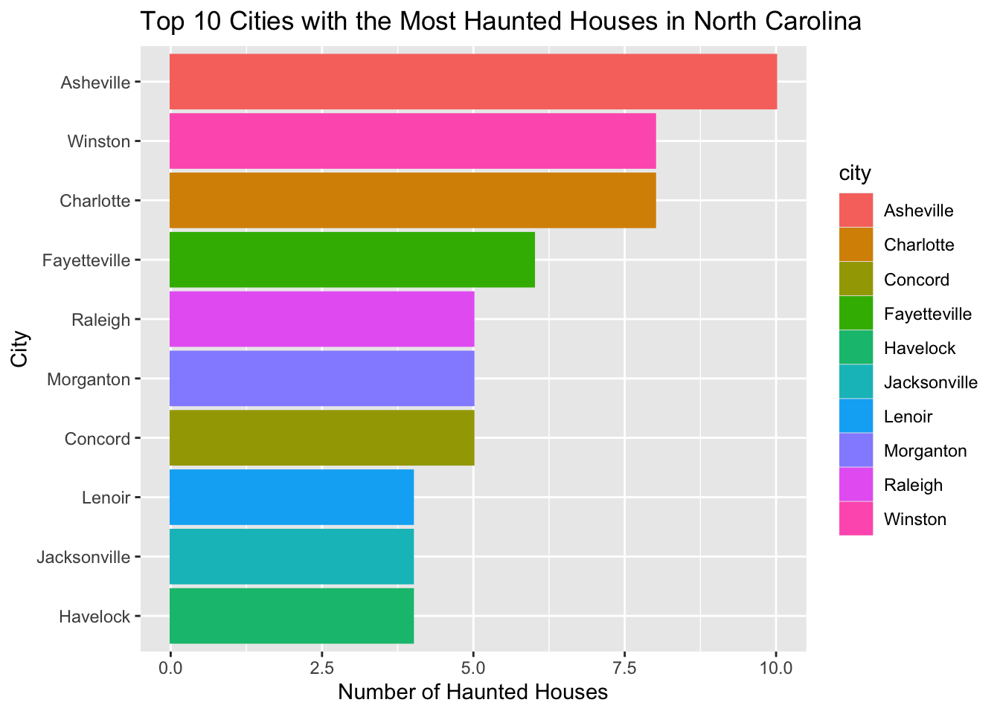
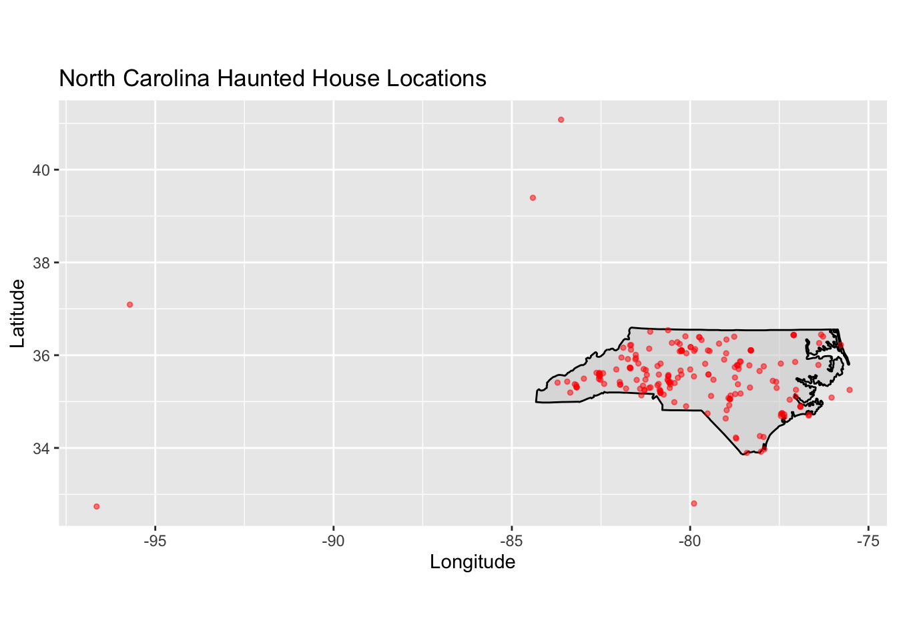
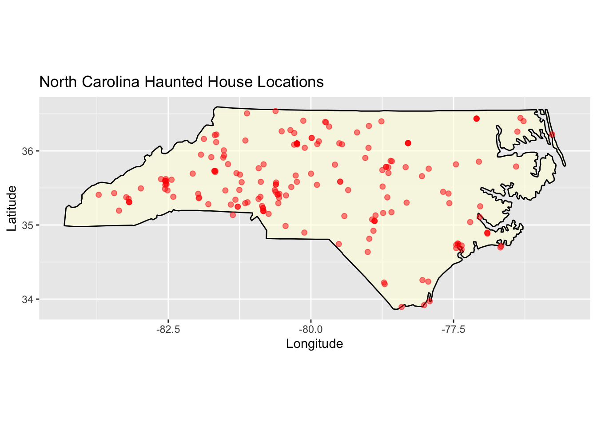
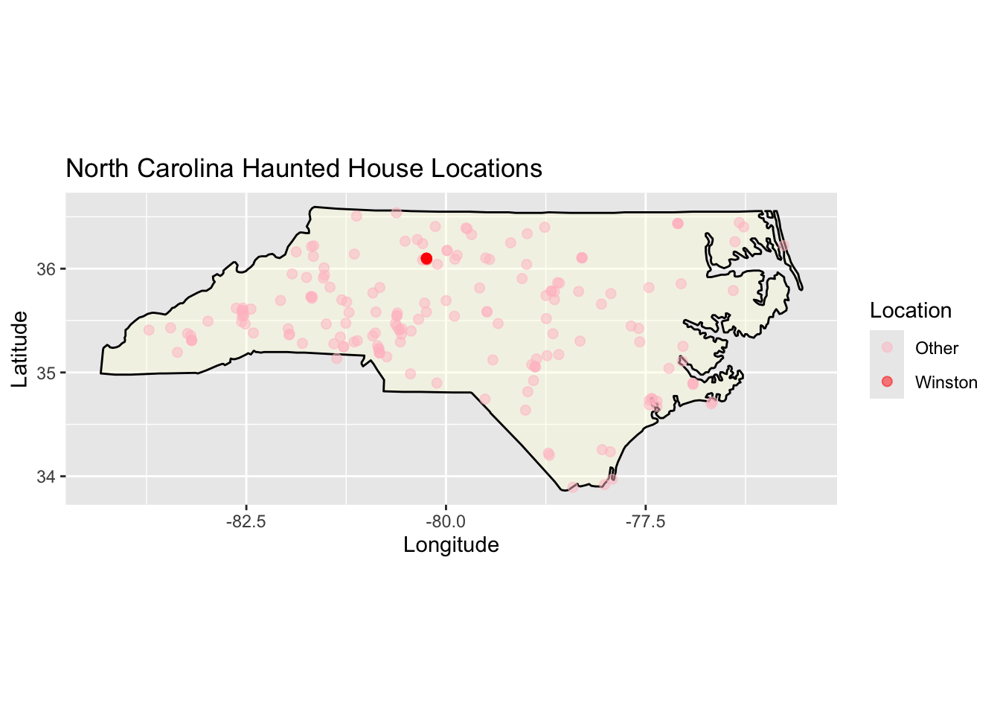
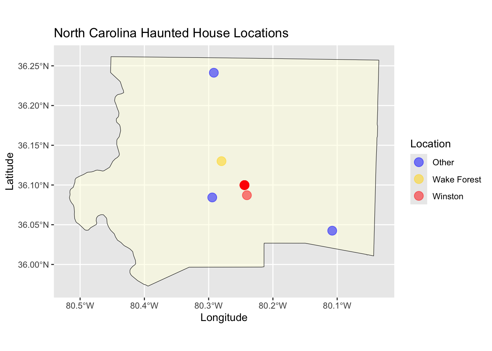

Data from https://github.com/rfordatascience/tidytuesday/blob/main/data/2023/2023-10-10/readme.md


``` r
##install.packages("tidytuesdayR")
##install.packages(c("sf", "tigris", "ggplot2", "ggmap"))

library(maps)
library(ggplot2)
library(tidyverse)
library(sf)
library(tigris)

haunted_places <- readr::read_csv('https://raw.githubusercontent.com/rfordatascience/tidytuesday/main/data/2023/2023-10-10/haunted_places.csv')
```

I get the haunted houses dataset from the Tidy Tuesday Github (https://github.com/rfordatascience/tidytuesday/blob/main/data/2023/2023-10-10/readme.md). My research question in general is to see where are the haunted houses in the US! 

### Haunted houses in North Caronlina


``` r
##first I want to know where are the haunted houses in North Carolina.
##I would filter the dataset into only houses in NC.
NC_haunted_places <- haunted_places %>% 
  filter(state == "North Carolina")
```
Now I know that there are 211 haunted houses in North Caronlina, which is a litte scary. Next, I wanted to know how they are located within North Caronlina. 

### Most and Least Haunted houses in North Carolina


``` r
##After taking a look at the dataset, I want to merge Winston-Salem to Winston because they refer to the same location. 
NC_haunted_places <- NC_haunted_places %>%
mutate(
  city = case_when(
    city == "Winston-Salem" ~ "Winston",
    TRUE ~ city
  ))

##I want to see which city has the most and least haunted houses in NC. 
haunted_counts_NC <- NC_haunted_places %>%
  count(city, name = "num_haunted_houses") %>% 
  arrange(desc(num_haunted_houses))
print(haunted_counts_NC)
```

```
## # A tibble: 128 × 2
##    city         num_haunted_houses
##    <chr>                     <int>
##  1 Asheville                    10
##  2 Charlotte                     8
##  3 Winston                       8
##  4 Fayetteville                  6
##  5 Concord                       5
##  6 Morganton                     5
##  7 Raleigh                       5
##  8 Havelock                      4
##  9 Jacksonville                  4
## 10 Lenoir                        4
## # ℹ 118 more rows
```

``` r
##Mean 
mean_hauntedhousesNC <- mean(haunted_counts_NC$num_haunted_houses)
##Standard deviation 
sd_hauntedhousesNC <- sd(haunted_counts_NC$num_haunted_houses)
```

Before looking at the houses location visualization, I merged Winston-Salem to Winston. After that, I wanted to check which cities in NC has the most or least haunted houses. According to the dataset, Asheville appeared to have the most haunted houses, n = 10. On average, each city in North Carolina seems to has 1.65 haunted houses. 

### Top ten cities with the most Haunted Houses in North Carolina


``` r
##I also want to see a bar graph of which city has the most haunted houses.
top_haunted_cities <- NC_haunted_places %>%
  count(city, name = "num_haunted_houses") %>%
  arrange(desc(num_haunted_houses)) %>%
  slice_head(n = 10)

## Create the bar plot for the top ten cities 
ggplot(top_haunted_cities, aes(x = reorder(city, num_haunted_houses), y = num_haunted_houses, colour = city, fill = city)) +
  geom_bar(stat = "identity") +  
  labs(title = "Top 10 Cities with the Most Haunted Houses in North Carolina",
       x = "City",
       y = "Number of Haunted Houses") +
       coord_flip()
```

<!-- -->

### visualized map of NC


``` r
## get the basic North Carolina map data
nc_map <- map_data("state")
## filter for North Carolina
nc_map <- subset(nc_map, region == "north carolina")
## get the map plot
ggplot()+
  geom_polygon(data = nc_map, aes(x = long, y = lat, group = group),
               fill = "lightgray", color = "black", alpha = 0.6) +
  geom_point(data = NC_haunted_places, aes(x = longitude, y = latitude),
             color = "red", alpha = 0.5, size = 1) +
   labs(
    title = "North Carolina Haunted House Locations",
    x = "Longitude", 
    y = "Latitude"
  ) +
  coord_fixed(1.3)
```

```
## Warning: Removed 23 rows containing missing
## values or values outside the scale
## range (`geom_point()`).
```

<!-- -->

Based on the graph, we can see that some of the dots seemed to locate outside of North Carolina. I want these to be excluded from the data so the graph can look bigger and more accurately representing data within NC. 

### Filter out the outliers and refine the dataset


``` r
##Looking at the graph, I want to filter out the data that are outside of the range of: 37> latitude > 33.
NC_haunted_places_filtered <- NC_haunted_places %>%
  filter(!(latitude < 35.5 & longitude > -76.25)) %>%
  filter(latitude > 33 & latitude < 37)

##Now I will plot the graph again
ggplot()+
  geom_polygon(data = nc_map, aes(x = long, y = lat, group = group),
               fill = "lightyellow", color = "black", alpha = 0.6) +
  geom_point(data = NC_haunted_places_filtered, aes(x = longitude, y = latitude),
             color = "red", alpha = 0.5, size = 1.8) +
   labs(
    title = "North Carolina Haunted House Locations",
    x = "Longitude", 
    y = "Latitude"
  ) +
  coord_fixed(1.3)
```

<!-- -->

Now this plot has shown how the haunted houses are located within NC, and we can also see how many of them are close to each other by looking at the overlap between the dots.

### Winston Salem Haunted Houses


``` r
##Lastly, I am very interested in where are all the haunted houses located within Winston Salem.
NC_haunted_places_winston <- NC_haunted_places_filtered %>%
  mutate(winstonsalem = ifelse(city == "Winston", "Winston", "Other"))

##Plot with different colors for Winston-Salem vs. Other
ggplot() +
  geom_polygon(data = nc_map, aes(x = long, y = lat, group = group),
               fill = "lightyellow", color = "black", alpha = 0.4) +
  geom_point(data = NC_haunted_places_winston, 
             aes(x = longitude, y = latitude, color = winstonsalem),
             alpha = 0.5, size = 2) +
  scale_color_manual(values = c("Winston" = "red", "Other" = "pink")) +
  labs(
    title = "North Carolina Haunted House Locations",
    x = "Longitude", 
    y = "Latitude",
    color = "Location"
  ) +
  coord_fixed(1.3)
```

<!-- -->


``` r
##I used ChatGPT to help me to get North Carolina counties data
nc_counties <- counties(state = "NC", cb = TRUE, year = 2020)
```

```
## 
  |                                                                            
  |                                                                      |   0%
  |                                                                            
  |                                                                      |   1%
  |                                                                            
  |=                                                                     |   1%
  |                                                                            
  |=                                                                     |   2%
  |                                                                            
  |==                                                                    |   2%
  |                                                                            
  |==                                                                    |   3%
  |                                                                            
  |===                                                                   |   4%
  |                                                                            
  |====                                                                  |   5%
  |                                                                            
  |====                                                                  |   6%
  |                                                                            
  |=====                                                                 |   7%
  |                                                                            
  |======                                                                |   8%
  |                                                                            
  |=======                                                               |  10%
  |                                                                            
  |========                                                              |  11%
  |                                                                            
  |========                                                              |  12%
  |                                                                            
  |=========                                                             |  13%
  |                                                                            
  |==========                                                            |  15%
  |                                                                            
  |===========                                                           |  16%
  |                                                                            
  |============                                                          |  17%
  |                                                                            
  |=============                                                         |  19%
  |                                                                            
  |==============                                                        |  20%
  |                                                                            
  |===============                                                       |  22%
  |                                                                            
  |================                                                      |  22%
  |                                                                            
  |=================                                                     |  24%
  |                                                                            
  |=================                                                     |  25%
  |                                                                            
  |==================                                                    |  26%
  |                                                                            
  |===================                                                   |  27%
  |                                                                            
  |====================                                                  |  29%
  |                                                                            
  |=====================                                                 |  31%
  |                                                                            
  |======================                                                |  32%
  |                                                                            
  |=======================                                               |  33%
  |                                                                            
  |========================                                              |  35%
  |                                                                            
  |=========================                                             |  36%
  |                                                                            
  |==========================                                            |  37%
  |                                                                            
  |===========================                                           |  38%
  |                                                                            
  |===========================                                           |  39%
  |                                                                            
  |============================                                          |  39%
  |                                                                            
  |============================                                          |  40%
  |                                                                            
  |=============================                                         |  42%
  |                                                                            
  |==============================                                        |  42%
  |                                                                            
  |==============================                                        |  43%
  |                                                                            
  |===============================                                       |  44%
  |                                                                            
  |================================                                      |  45%
  |                                                                            
  |=================================                                     |  47%
  |                                                                            
  |=================================                                     |  48%
  |                                                                            
  |==================================                                    |  49%
  |                                                                            
  |===================================                                   |  50%
  |                                                                            
  |====================================                                  |  52%
  |                                                                            
  |=====================================                                 |  53%
  |                                                                            
  |======================================                                |  55%
  |                                                                            
  |=======================================                               |  56%
  |                                                                            
  |========================================                              |  58%
  |                                                                            
  |=========================================                             |  59%
  |                                                                            
  |==========================================                            |  61%
  |                                                                            
  |===========================================                           |  62%
  |                                                                            
  |============================================                          |  63%
  |                                                                            
  |=============================================                         |  65%
  |                                                                            
  |==============================================                        |  66%
  |                                                                            
  |===============================================                       |  68%
  |                                                                            
  |================================================                      |  69%
  |                                                                            
  |=================================================                     |  71%
  |                                                                            
  |==================================================                    |  72%
  |                                                                            
  |===================================================                   |  72%
  |                                                                            
  |===================================================                   |  74%
  |                                                                            
  |====================================================                  |  74%
  |                                                                            
  |=====================================================                 |  75%
  |                                                                            
  |======================================================                |  77%
  |                                                                            
  |=======================================================               |  78%
  |                                                                            
  |========================================================              |  80%
  |                                                                            
  |=========================================================             |  81%
  |                                                                            
  |==========================================================            |  83%
  |                                                                            
  |===========================================================           |  84%
  |                                                                            
  |============================================================          |  86%
  |                                                                            
  |=============================================================         |  87%
  |                                                                            
  |=============================================================         |  88%
  |                                                                            
  |==============================================================        |  88%
  |                                                                            
  |==============================================================        |  89%
  |                                                                            
  |===============================================================       |  90%
  |                                                                            
  |================================================================      |  92%
  |                                                                            
  |=================================================================     |  93%
  |                                                                            
  |==================================================================    |  94%
  |                                                                            
  |===================================================================   |  95%
  |                                                                            
  |====================================================================  |  97%
  |                                                                            
  |===================================================================== |  98%
  |                                                                            
  |======================================================================| 100%
```

``` r
##Then I want to filter the Forsyth County, which contains Winston-Salem
forsyth_county <- nc_counties %>% filter(NAME == "Forsyth")


##I googled the location information of Forsyth County and want to filter the haunted locations inside Forsyth County
winston_haunted <- NC_haunted_places_filtered %>%
  filter(latitude > 35.96 & latitude < 36.25 & 
         longitude > -80.50 & longitude < -80.04)

##I am very interested in where are all the haunted houses located within Winston Salem.
winston_haunted <- winston_haunted %>%
  mutate(winstonsalem = ifelse(city == "Winston", "Winston", "Other"))

##I added Wake Forest location into the dataset because I also want to see how far these haunted houses are from our campus.
winston_haunted <- winston_haunted %>%
  add_row(city = "Winston",
  latitude = 36.13,
  longitude = -80.28,
  country = "United States",
  description = "Wake Forest location",
  location = "Wake Forest University",
  state = "North Carolina",
  state_abbrev = "NC",
  city_longitude = -80.25444,
  city_latitude = 36.10396,
  winstonsalem = "Wake Forest"
  )

##The plot showing where is Wake Forest campus and the surrounding haunted houses in winston salem and Forsyth county. 
ggplot() +
  geom_sf(data = forsyth_county, fill = "lightyellow", color = "black", alpha = .5) +
  geom_point(data = winston_haunted, 
             aes(x = longitude, y = latitude, color = winstonsalem),
             alpha = 0.5, size = 4) +
  scale_color_manual(values = c("Winston" = "red", "Other" = "blue", "Wake Forest" = "gold")) +
  labs(
    title = "North Carolina Haunted House Locations",
    x = "Longitude", 
    y = "Latitude",
    color = "Location"
  ) +
  coord_sf()
```

<!-- -->

In general, we can see that Winston-salem is one of the top ten cities with the most haunted houses! To be more speicific, there are 8 haunted houses in Winston-salem.  
